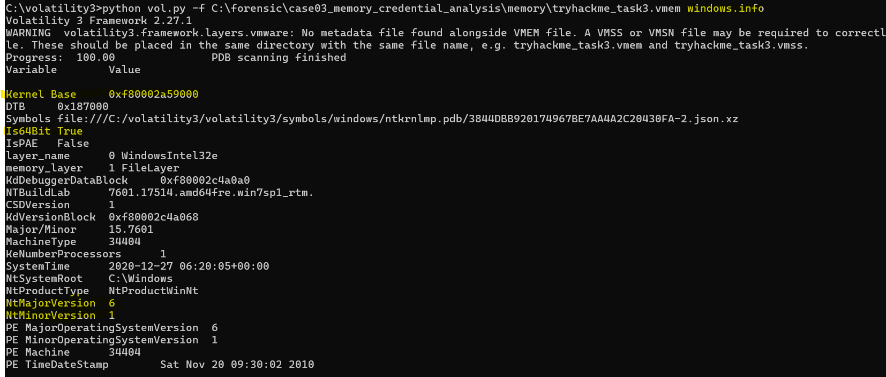
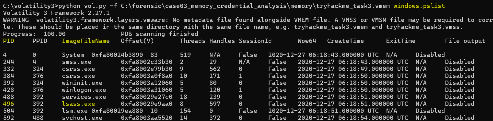

# Memory Forensics: User Credential Recovery from Windows 7 Memory Dump

 Windows 7 메모리 덤프에서 사용자(john)의 비밀번호를 복구하기 위해 
lsass.exe 기반 자격 증명 분석을 수행하고, 
Volatility 3의 한계를 확인한 뒤 Volatility2 로 전환하여 
NTML 해시를 추출, 평문화한 메모리 포렌식 사례 분석 프로젝트

## 1. 프로젝트 개요 
**분석 목적**
해당 프로젝트는 [포트폴리오2: Windows 메모리 덤프 정상성 분석](https://github.com/hoongji/memory_forensics_process_analysis) 에서 사용한 동일한 메모리 덤프를 대상으로 진행한다.
시스템의 정상 여부 확인이 아닌 사용자 인증 정보가 메모리에 잔존하는지 여부를 검증하고, 이를 실제 문제로 연결하는 것을 목표로 한다.

구체적으로, 메모리 내 LSASS(Local Security Authority Subsystem Service) 프로세스를 중심으로 사용자의 계정 정보 및 NTML 해시 형태의 자격 증명 흔적을 추출하고, 외부 도구를 활용하여 이를 평문 비밀번호로 복구하는 과정을 수행하였다.

최종적으로는 
메모리 덤프의 사용자로 추정되는 John 계정의 비밀번호를 복구하는 것을 핵심 목표로 설정하였다. 

# 2. 분석 환경 및 데이터 출처
Host OS: Windows
분석 대상: Windows 7 SP1 x64

분석 도구: 
- Python 3.10.11
- python 2.17.18
- Volatility 2.6
- Volatility 3
- pypykatz
- hashcat 7.1.2
- John the Ripper 1.9.0
- Wordlist: rockyou.txt

### 데이터 출처

- 메모리 덤프 출처: TryHackMe – Memory Forensics 실습 과제
- 제공 형태: Windows 메모리 덤프 (VMEM)
- 시나리오: 가상의 사용자(John) 환경에서 수집된 메모리 덤프
- 목적: 디지털 포렌식 분석 흐름 학습 및 사용자 행위 분석 연습 (해당 덤프는 교육 목적의 공개 자료)
- 참고 링크: [https://tryhackme.com/](https://tryhackme.com/room/memoryforensics)

# 3. 초기 환경
**3.1 OS 정보 확인** 

windows.info 플러그인을 통해 대상 시스템이 Windows 7 계열 64bit 환경임을 확인함.
Kernel Base 주소가 정상적으로 식별되었고 이후 프로세스 및 인증 정보 분석이 가능한 상태로 판단된다.

# 4 분석 접근 전략 

- 해당 프로젝트는 악성 행위 탐지보다는 **사용자 인증 정보가 메모리에 잔존할 가능성**에 초첨을 맞춘다.
  
- **본 분석에서는 다음 질문을 중심으로 접근한다 :**
  1. 실제로 John 이라는 사용자가 존재하는가?
  2. 인증을 담당하는 핵심 프로세스가 정상 상태인가?
  3. 자격 증명 정보 분석이 가능한 메모리 구조인가?

 # 5 사용자 존재 여부 및 인증 프로세스 검증

 ### 5.1 사용자 계정 직접 확인 시도
 - Volatilit 2의 **windows.users** 플러그인을 통해 사용자 확인을 시도했다.
 - 프로젝트 분석시 먼저 사용한 Volatility 3 버전에서는 제거된 플러그인 이었기에 직접적인 사용자 목록은 확인이이 불가하였다.
 - 대신 인증 프름을 담당하는 프로세스를 기준으로 간접 검증 전략으로 변경하였다.

### 5.2 lsass.exe 프로세스 확인 
*lsass.exe는 Windows에서 인증,계정,해시 처리를 담당하는 핵심 프로세스이므로 사용자 비밀번호, NTLM 해시, Kerberos 티켓 등은 **로그인 이후 lsass 메모리에 잔존 가능성**이 있다고 판단하여 lsass.exe 프로세스를 확인하고자 하였다.*

 
lsass.exe (PID 496) 이 정상적인 경로로 실행됨을 확인하였다. 

 
실행 경로가 C:\Windows\System32\lsass.exe 임을 확인하였다. 

정상 경로와 정상 PID 이므로 위장 프로세스 가능성이 낮다고 판단하였다. 

### 5.3 메모리 점유 여부 확인 

windows.memmap 플러그인을 통해 pid 496(lsass.exe)가 다수의 가상 메모리 영역을 실제로 점유 중임을 확인하였다. 
출력이 수십줄이 나와 프로세스가 정상적으로 메모리에 되었음을 확인하였다. (덤프 대상이 존재함)
이를 통해 해당 프로세스의 메모리 덤프가 가능하다고 판단하고, 자격 증명 정보 분석을 위해 메모리 덤프를 진행하였다. 

# 6 lsass.exe 메모리 덤프 및 한계
### 6.1 메모리 덤프 

pid 496(lsass.exe)가 사용하던 메모리 영역 파일로 매핑된 영역(imageSectionObject)을 개별 파일로 덤프했다. 

windows.dumpdfiles 플러그인을 사용하여 lsass.exe(PID 496) 프로세스의 메모리 영역을 덤프하였다. 
덤프 결과, lsass.exe 본체와 함께 인증 관련 DLL(msv1_0.dll,kerberos.dll, wdigest.dll, samsrv.dll 등)이 추출되었으며, 이는 lsass 프로세스가 정상적으로 인증 모듈을 로드하고 있었음을 의미한다. 
이 중 lsass.exe 메모리 이미지를 대상으로 자격 증명 분석을 진행하였다. 

*생성된 파일 중 ImageSectionObject.lsass.exe.img 경로를 확인한다. (mimikatz or pypykatz 사용)*

### 6.2 자격 증명 추출 시도 (pypykatz)

Volatility3 환경에서 lsass 프로세스 메모리를 대상으로 자격 증명 추출을 시도하기 위해 *pypykatz* 도구를 사용하였다.

앞선 단계에서 **windows.dumpfiles** 플러그인을 통해 lsass.exe의 메모리 이미지(**ImageSectionObject.lsass.exe.img**) 를 확보하였으며, 이를 기반으로 다음과 같이 pypykatz 실행을 시도하였다. 

그러나 해당 환경에서는 pypykatz 가 정상적으로 실행되지 않았으며, 자격 증명(계정 정보, 해시, 비밀번호)을 추출하는 단계까지 도달하지 못하였다. 
 
*python -m pypykatz* , *pypykatz lsa minidump <dumpfile>* , *패키지 재설치(pip uninstall / reinstall)* , *명령어 변경 및 강제 실행*을 시도하였으나 모두 동일한 오류가 발생되었다. 이로 인해 lsass 덤프 분석 단계 이전에 pypykatz 도구가 Python 실행 단계에서 정상적으로 구동되지 않았다는 사실을 알 수 있었다. 

### 6.2.1 원인 판단 및 분석 방향 재검토

초기에는 실행 환경 또는 절차상의 문제 가능성을 고려하였으나, 
추가적으로 확인한 결과,  해당 메모리 덤프는 Volatility 2 시절 분석 방식(SAM/SYSTEM 기반 자격증명 추출)을 기반으로 설계되었기에 Volatility3 환경에서는 동일한 분석 흐름을 적용하기 어렵다. 

Volatility3 에서는 안정성과 구조적 분석을 우선하는 방향으로 일부 기능(예: hashdump... ) 이 제거되었기 때문에, 해당 과제에서 요구하는 자격 증명 복구를 수행하기에는 기능적 제약이 있을 것으로 판단했다.

이에 따라, 분석 목표를 달성하기 위해 Volatility 2 환경으로 전환하여 분석을 진행하였다.

# 7 Volatility2 전환 및 검증
### 7.1 프로파일 사전 검증 과정(imageinfo)

메모리 덤프의 운영체제 버전과 커널 구조를 추정하기 위해 Volatility2의 imageinfo 플러그인을 실행하였다. 

분석 결과, 여러 개의 예상 프로파일이 제시되었으며 이 중 **Win7SP1x64**를 사용하기로 결정했다. 

*해당 프로파일을 선택한 이유는 TryHackMe Windows 메모리 분석 문제에서 가장 빈번하게 사용되며, 공식 walkthrough에서도 주로 채택되는 프로파일이기 때문에 선택하였다.*

### 7.2 프로세스 구조 검증(pslist)

선택한 프로파일이 실제로 적절한지 확인하기 위해
**profile=Win7SP1x64 pslist** 플러그인을 실행하였다.

이 단계에서는 다음 두 자기를 중점적으로 확인하였다.

1. lsass.exe 프로세스의 존재 여부
2. 시스템 프로세스 트리가 정상적으로 파싱되는지 여부
   
lsass.exe 존재여부를 확인하고 pid , 시스템이 정상적으로 파싱되는지를 확인해보기로 했다. 
lsass.exe가 정상적인 부모 프로세스(wininit.exe) 하위에서 실행되고 있음을 확인함으로써, 해당 메모리 덤프는 자격증명 분석을 수행하기에 메모리 구조가 정상적으로 파싱되었음을 판단하였다. 

*시스템이 정상적으로 파싱되는지 = 메모리 덤프에서 커널 구조(KDBG)가 정상적으로 식별되었고, 프로세스 리스트가 일관된 구조로 파싱되고 있음을 의미*

### 7.3 NTLM 해시 추출(hashdump)

앞선 단계(6.2) 에서 Volatility3 환경에서 pypykatz를 이용한 자격 증명 복구를 시도하였다. 
그러나 본 과제는 TryHackMe에서 명시적으로 Volatility 2 사용을 권장하고 있으며 분석 대상 메모리 덤프 역시 Volatility 2 기반의 분석 흐름을 전제로 설계된 문제이다. 

이에 따라 권유받은 분석 방향에 따라, 동일한 메모리 덤프를 
Volatility2의 환경에서 재분석하기로 결정하였다.

Volatility 2에서는 hashdump 플러그인을 통해 사용자의 계정의 NTLM 해시를 직접 추출할 수 있으며, 이를 통해 비밀번호 복구를 위한 최소한의 인증 정보를 확보할 수 있다. 

hashdump 실행 결과, john 사용자 계정에 대한 NTLM 해시 값이 정상적으로 추출되었으며, 해당 값은 아직 평문화되지 않은 상태의 해시 문자열이다. 

이후 단계에서는 추출된 NTLM 해시를 대상으로 외부 크랙 도구를 사용하여 비밀번호 평문화 과정을 진행하였다.

## 8 비밀번호 평문화 과정

Volatility 2 를 통해 추출한 NTLM 해시를 대상으로 비밀번호 평문화 과정을 수행하였다. 해당 단계에서는 먼저 hashcat을 이용한 크랙을 시도하였다. 

### 8.1 해시 파일 생성 

**hashdump** 를 통해 추출한 NTLM 해시 값을 별도의 텍스트 파일로 정리하였다. 해당 파일에는 평문화되지 않은 NTLM 해시 문자열이 저장되어 있다.

### 8.2 hashcat을 이용한 크랙 시도

hashcat 7.1.2 버전을 설치한 후, *hash.txt* 파일과 사전 파일(*rockyou.txt*) 을 동일한 디렉토리에 배치하였다. 

hashcat은 설치 경로인 C:\hashcat-7.1.2 디렉토리에서 실행하였다.

실행 결과, 크랙 과정이 정상적으로 진행되지 않고 *Strated* 이후 즉시 *Stopped* 상태로 종료되는 현상이 반복적으로 발생하였다. 

*hashcat 자체의 설정 오류 가능성을 배제하기 위해 다음과 같은 기본 검증 절차를 수행하였다.*

해시 파일(hash.txt) 내용 정상 여부 확인

hashcat 설치 정상 여부 확인

사전 파일 존재 및 크기 확인 (dir rockyou.txt)

모든 파일과 실행 환경은 정상적으로 확인되었으며, 문제 원인은 **하드웨어(인텔 CPU) 및 드라이버 충돌**로 인한 Hashcat 실행 제한으로 판단하였다. 

이에 따라 다른 크랙 도구를 사용하여 비밀번호 평문 복구를 진행하기로 결정했다.

## 9. John the Ripper를 이용한 비밀번호 복구 
hashcat 실행이 환경적인 제약으로 인해 정상적으로 이루어지지 않아, 대체 도구로 John the Ripper를 사용하여 비밀번호 평문화 작업을 수행하였다.

John the Ripper는 CPU 기반 환경에서도 NTLM 해시에 대한 평문화를 안정적으로 수행할 수 있다고 판단하여 해당 도구를 사용하기로 결정했다. 

rockyou.txt 사전을 기반으로 크랙을 진행하였다.
해당 명령어 실행 결과, John 사용자 계정의 비밀번호가 정상적으로 평문화되었음을 확인할 수 있었다. 

크랙된 결과만을 명확히 확인하기 위해 다음 명령어를 사용하여 결과를 출력하였다. 이를 통해 John의 계정의 실제 비밀번호(평문)를 최종적으로 확인하였다. 

## 10. 결론

본 프로젝트에서는 TryHackMe 메모리 덤프 파일을 대상으로 
**Windows 환경에서의 자격 증명 추출 및 비밀번호 복구 과정**을 수행하였다. 

Volatility를 활용한 메모리 포렌식 분석부터, NTLM 해시 추출 및 사전 기반 크랙까지의 전체 흐름을 실습하는 것을 목표로 하였다. 

분석 초기에는 Volatility 3 환경에서 pypykatz를 이용한 자격 증명 추출을 시도하였으나, 본 과제의 메모리 이미지 및 요구사항은 Volatility 2 기반 분석을 전제로 설계된 문제임을 확인하였다. 
따라서 분석도수를 Volatility 2로 전환했고, hashdump 플러그인을 통해 NTLM 해시를 정상적으로 확보할 수 있었다. 

이후 추출된 해시를 대상으로 hashcat을 이용한 크랙을 시도하였으나, 
실습 환경의 하드웨어 및 드라이버 제약으로 인해 크랙 과정이 정상적으로 진행되지 않았다. 
실행 환경을 다시 검증 후 도구를 대체하기로 결정했다. 
대체 도구인 John the Ripper 를 사용하여 동일한 평문화과정을 수행하였다. 
결과적으로 John의 사용자 계정의 실제 비밀번호를 평문화하여 구할 수 있었다. 

이번 프로젝트에서는 단일 도구에 의존하지 않고, 
환경, 버전, 하드웨어의 제약에 따라 분석 전략을 유연하게 전환하는 경험을 할 수 있었다.
분석 과정에서 발생한 여러 변수에 대해 당황하지 않고 대응하며 분석을 이어나간 경험은 실제 포렌식 분석 상황을 가정했을 때 의미있는 경험이었다.

또한 Volatility버전에 따른 기능 및 특성의 차이를 직접 비교하며 이해할 수 있었고, 이는 도구 선택과 분석 방향을 판한다는 데 있어 중요한 학습 요소가 되었다.

특히 해시 추출 및 크랙 검증 과정은 처음 수행해보는 절차였으나,
본 프로젝트를 통해 자격증명 분석의 전체적인 흐름을 경험함으로써
Windows 메모리 포렌식 및 침해 대응 분석에 대한 이해도를 한층 높일 수 있었다.
